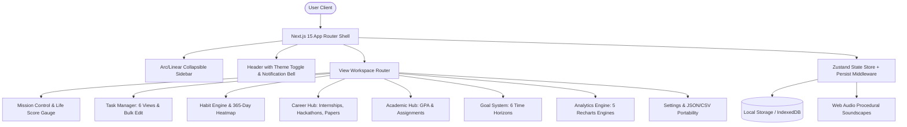
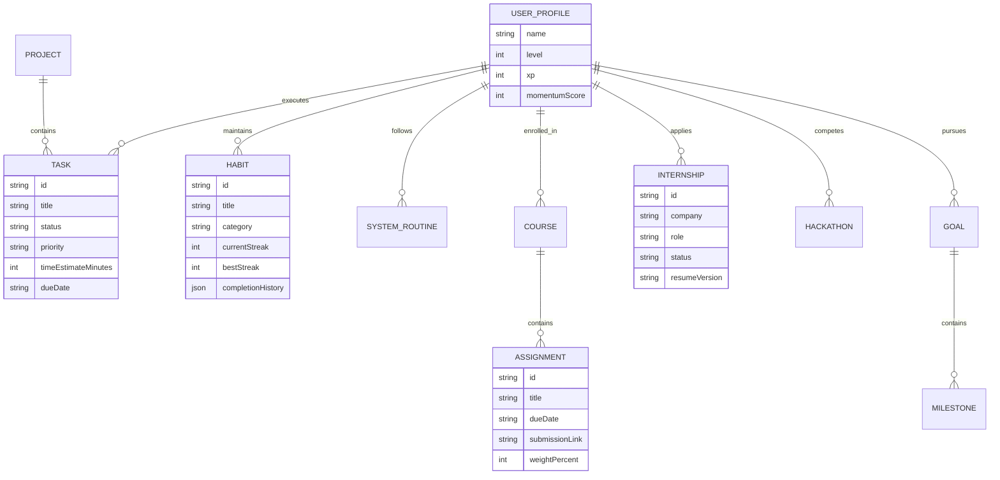

# MOMENTUM OS 🚀
> **Tagline**: *"Build Systems, Not Motivation."*

MOMENTUM OS is a production-grade **Personal Productivity Operating System** built using **Next.js 15 App Router**, **Tailwind CSS v4**, **Zustand**, **Recharts**, **Framer Motion**, and **Web Audio API**.

---

## ⚡ Flagship Capabilities ($20/mo Premium SaaS Grade)

1. **Mission Control Command Center**: Aggregated command overview with Today's Focus, Urgency Score, Priority Tasks, Upcoming Deadlines, and Focus Time.
2. **Dynamic Life Score SVG Gauge**: Real-time 0-100 Life Score evaluating Habit Success %, Task Completion %, Goal Velocity, and Focus Hours with radial SVG progress meters.
3. **Industry-Leading Habit Engine**: Full habit lifecycle (**Create, Edit, Delete, Pause, Archive, Duplicate, Skip Today, Restore**), 10 Categories, 365-Day GitHub Contribution Heatmap, and Milestone Confetti Explosions.
4. **Ultimate Task Command Manager**: 6 Views (**List Matrix, 6-Column Kanban, Gantt Timeline, Calendar Grid, Status Board, Compact Data Table**), 6 Statuses (**Todo ⏹️, Doing ⏳, Blocked ⛔, Waiting ⏸️, Completed ✅, Cancelled ❌**), and Bulk Edit Actions.
5. **Career & Academic Hub**:
   - **Academic**: Course Credits, GPA Trajectory Calculator, Assignment Cards with Live Countdowns (`2d 14h 30m remaining`), Submission Links, Attendance %, and CGPA Goals.
   - **Career**: Internship 6-Stage Kanban Pipeline (Wishlist → Applied → Assessment → Interview → Offer → Rejected), Resume Version Tracker, Portfolio Links, Hackathons Matrix with Team Rosters & Tech Stacks, Research Papers, and Certifications.
6. **Goal Management System**: 6 Time Horizons (**Daily, Weekly, Monthly, Quarterly, Yearly, Life**), Vision Statements, Core "Why" Drivers, Self-Rewards, and Weekly/Monthly/Yearly Reflection Rituals.
7. **Premium Analytics Dashboard**: 5 Recharts Chart Engines (**Bar, Line, Area, Radar, Pie**), Animated Counter Tickers, 365-Day Heatmap, and Burnout Mitigation Warning Indicators.
8. **RPG Achievements Engine**: Level & XP progression with unlockable Badges (**Coding Beast 💻, Consistency King 👑, Internship Hunter 💼, Hackathon Hero 🏆, Study Warrior 📚, Goal Crusher 🎯, Quick Learner ⚡**).
9. **Project Health & Burndown**: Recharts Sprint Burndown Curve, Task Velocity (tasks/wk), and Risk Level indicators (Low, Medium, High).
10. **Data Portability & Offline PWA**: 1-Click JSON Backup Export/Import, CSV Spreadsheet Export, Offline Manifest (`public/manifest.json`), `Cmd+K` Command Palette, and Floating Action Button (`+` FAB).

---

## 📐 System Architecture Diagram



---

## 🗄️ Database ER Diagram



---

## 📂 Folder Structure

```
Momentum_OS/
├── public/
│   ├── manifest.json                    # PWA Web Application Manifest
│   └── favicon.ico
├── src/
│   ├── app/
│   │   ├── globals.css                  # CSS Variables & Glassmorphism Tokens
│   │   ├── layout.tsx                   # Root Layout with ErrorBoundary & PWA metadata
│   │   ├── page.tsx                     # Next.js 15 Main View Workspace Router
│   │   └── providers.tsx                # next-themes Client Provider
│   ├── store/
│   │   └── useMomentumStore.ts          # Zustand Central State Engine & CSV/JSON Actions
│   ├── types/
│   │   └── index.ts                     # 25-Module Domain Interfaces & Schemas
│   ├── utils/
│   │   ├── analyticsHelpers.ts          # Life Score Formula & CSV Exporter
│   │   ├── initialData.ts               # Flagship Demonstration Datasets
│   │   └── soundEngine.ts               # Web Audio API Synthesizer
│   └── components/
│       ├── academic/                    # SemesterTrackerView & AssignmentModal
│       ├── achievements/                # AchievementsView & RPG Badges
│       ├── analytics/                   # AnalyticsView & 5 Recharts Engines
│       ├── calendar/                    # CalendarView & Timeblocker
│       ├── career/                      # CareerTrackerView, Internship & Hackathon Modals
│       ├── common/                      # Header, Sidebar, CommandPalette, ErrorBoundary
│       ├── dashboard/                   # MissionControlView & LifeScoreGauge
│       ├── focus/                       # FocusView & Pomodoro Sanctuary
│       ├── goals/                       # GoalsView, LifeProgressDashboard, GoalModal
│       ├── habits/                      # HabitsView, HabitCard, GithubHeatmap
│       ├── journal/                     # JournalView & Markdown Notes
│       ├── projects/                    # ProjectHealthView & Recharts Burndown
│       ├── settings/                    # SettingsView & Backup Controls
│       ├── systems/                     # SystemsView & Routine Stacks
│       ├── tasks/                       # TasksView, TaskKanban, TaskTimeline, TaskTable
│       └── ui/                          # Button, Card, Input, Badge, ProgressBar, FAB
```

---

## 🚀 1-Click Vercel Deployment Instructions

1. **Clone & Install Dependencies**:
   ```bash
   git clone https://github.com/your-username/Momentum_OS.git
   cd Momentum_OS
   npm install
   ```

2. **Run Local Development Server**:
   ```bash
   npm run dev
   ```
   Open [http://localhost:3000](http://localhost:3000) in your browser.

3. **Production Build & Verification**:
   ```bash
   npm run build
   ```

4. **Deploy to Vercel**:
   - Push repository to GitHub.
   - Import into [Vercel Dashboard](https://vercel.com).
   - Vercel automatically detects Next.js 15 App Router. Click **Deploy**!
